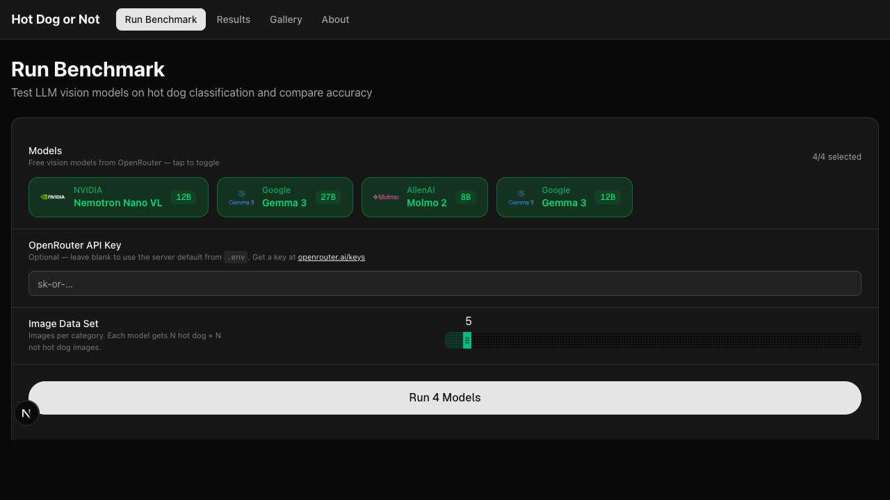
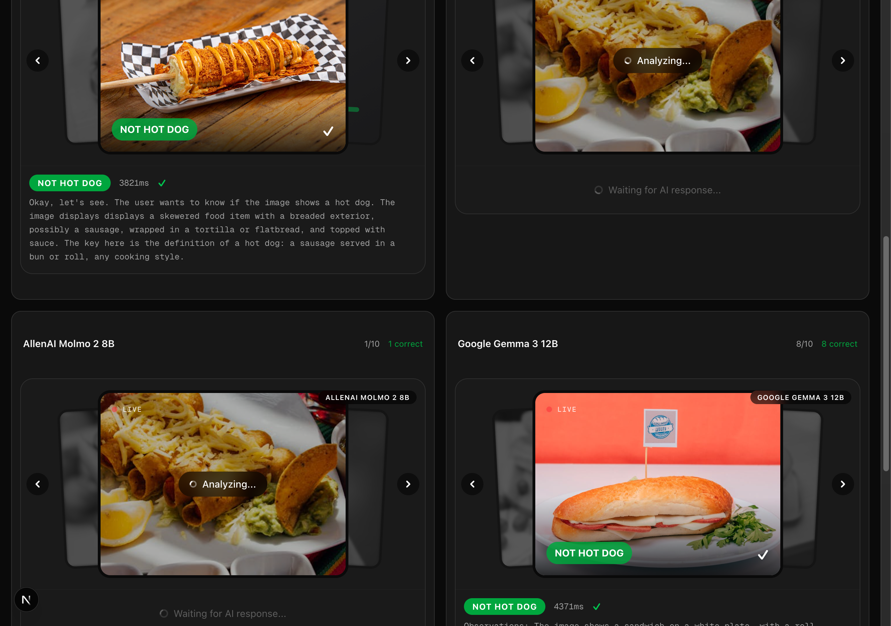
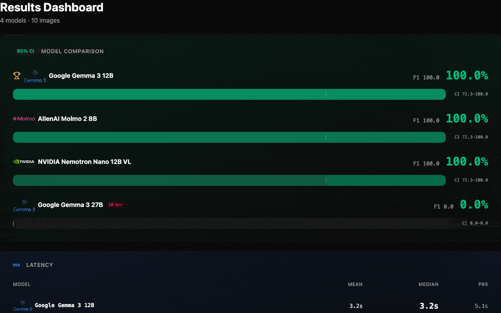

# Hot Dog or Not

**Compare how vision models see and reason about the world — not just their accuracy scores.**

<p align="center">
  
</p>

<p align="center">
  <a href="LICENSE"></a>
  
  
  
  
</p>

<p align="center">
  <a href="https://hotdogornot.xyz"><strong>hotdogornot.xyz</strong></a> &nbsp;|&nbsp;
  <a href="https://t.me/HotDogNotHotDog_Bot">Telegram Bot</a> &nbsp;|&nbsp;
  <a href="https://hotdogornot.xyz/battle">Live Battle Arena</a>
</p>

---

Same images. Same prompt. One question: *is this a hot dog?*

Each model answers and explains its reasoning. Compare traces side by side to see how different models perceive the same image — what they notice, what they miss, where they disagree.

## Features

### Benchmark Mode
Run multiple vision models against the same image set. Compare accuracy, latency, and reasoning traces side by side.

### Battle Arena
Send a food photo and two AI models classify it independently. Vote on which response is better in a blind evaluation — models are revealed after you vote. Rankings use the Bradley-Terry model.

### Telegram Bot
Send a photo to [@HotDogNotHotDog_Bot](https://t.me/HotDogNotHotDog_Bot) on Telegram. Powered by Claude Haiku 4.5 via [OpenClaw](https://openclaw.com) — classifies your image and battles Nemotron in real time. Returns the verdict and battle result (no full reasoning trace).

### OpenClaw Skill
Install the [hotdog skill](https://clawhub.ai/skills/hotdog) on any OpenClaw bot to add hot dog classification and battle capabilities.

## Why This Exists

Inspired by Silicon Valley's "Not Hotdog" app. Leaderboards show accuracy — this shows reasoning.

Is a corn dog a hot dog? A bratwurst in a bun? A deconstructed chili dog? Edge cases force models to reveal how they actually think. Compare traces side by side to see:

- **What they notice** — bun, sausage shape, condiments?
- **How they reason** — definition-based or pattern-matching?
- **Where they fail** — which edge cases break which models?

The dataset is adversarial: bratwursts, corn dogs, wraps, hot dog look-alikes. Models pick a side and explain why.

## What It Looks Like

<p align="center">
  <br>
  <em>Select models, set sample size, run</em>
</p>

<p align="center">
  <br>
  <em>4 models classify simultaneously with reasoning traces</em>
</p>

<p align="center">
  <br>
  <em>Accuracy, latency, and disagreement analysis</em>
</p>

## Quick Start

### Requirements

- Python 3.11+
- Node.js 18+
- Free [OpenRouter API key](https://openrouter.ai/keys)

### Backend

```bash
cd backend
python -m venv .venv && source .venv/bin/activate
pip install -r requirements.txt
cp .env.example .env  # paste your OPENROUTER_API_KEY
uvicorn main:app --reload --port 8000
```

### Frontend

```bash
cd frontend
npm install
npm run dev
```

Open [localhost:3000/run](http://localhost:3000/run), select models, and hit run.

### Docker

```bash
docker compose up
```

Backend at `localhost:8000`, frontend at `localhost:3000`.

## Models

All benchmark models run on [OpenRouter](https://openrouter.ai) free tier. Toggle on/off before each run.

| Model | Provider | Params |
|-------|----------|--------|
| Nemotron Nano VL | NVIDIA | 12B |
| Gemma 3 | Google | 27B |
| Gemma 3 | Google | 12B |
| Gemma 3 | Google | 4B |

Add your own in `backend/config.py`. Any free vision model on OpenRouter works.

## Battle API

The battle system pits two models against each other on user-submitted photos:

- **POST** `/api/battle/round` — submit a photo with one model's answer, get Nemotron's independent classification back
- **POST** `/api/battle/vote/submit` — submit a blind vote for the better response
- **GET** `/api/battle/leaderboard` — Bradley-Terry model rankings based on votes

Rate limited to 5 requests/minute per token. Images must be JPG/PNG/WebP/GIF, max 10MB.

## Dataset

180 images from [Pexels](https://www.pexels.com) — 90 hot dogs, 90 not-hot-dogs. The not-hot-dog category is intentionally chosen to look similar: sausages, wraps, burritos, things with mustard.

The sample size slider sets images **per category**. Setting it to 5 means 5 hot dogs + 5 not-hot-dogs = 10 total images per model, interleaved.

**Add your own images**: drop jpg/png/webp into `backend/data/test/hot_dog/` and `backend/data/test/not_hot_dog/`.

## How It Works

Each image goes to the model with:

```
Look at the image. Is it a hot dog (food: a sausage served in a bun/roll; any cooking style)?

Output exactly:
Observations: <brief description of what is visible>
Answer: <yes|no>
```

Temperature 0.0 for deterministic output. The answer is parsed for yes/no. Anything else counts as an error.

**Metrics**: accuracy (with 95% CI), precision, recall, F1, confusion matrix, mean/median/p95 latency.

**Disagreements**: images where models gave different answers, shown with side-by-side reasoning traces.

## Project Structure

```
backend/          Python FastAPI app
  routers/        API endpoints (benchmark, battle, classify)
  services/       OpenRouter client, rate limiter
  config.py       Model definitions and settings
  results/        JSONL run data and battle images
frontend/         Next.js 16 + shadcn/ui + Framer Motion
  src/app/        Pages: run, results, battle, gallery, about
docker-compose.yml
```

## Tech Stack

<table>
<tr>
<td width="50%">

**Backend**
- Python 3.11+
- FastAPI
- httpx (async HTTP)
- Pydantic

</td>
<td width="50%">

**Frontend**
- Next.js 16
- React 19
- Tailwind CSS
- shadcn/ui
- Framer Motion

</td>
</tr>
</table>

**API**: [OpenRouter](https://openrouter.ai) free tier vision models
**Deployment**: Docker + [Coolify](https://coolify.io)
**Bot**: [OpenClaw](https://openclaw.com) + Telegram

## Acknowledgments

[Silicon Valley](https://www.hbo.com/silicon-valley) (inspiration), [OpenRouter](https://openrouter.ai) (free models), [Pexels](https://www.pexels.com) (images), [shadcn/ui](https://ui.shadcn.com) (components), [OpenClaw](https://openclaw.com) (bot framework)

## License

[MIT](LICENSE)
